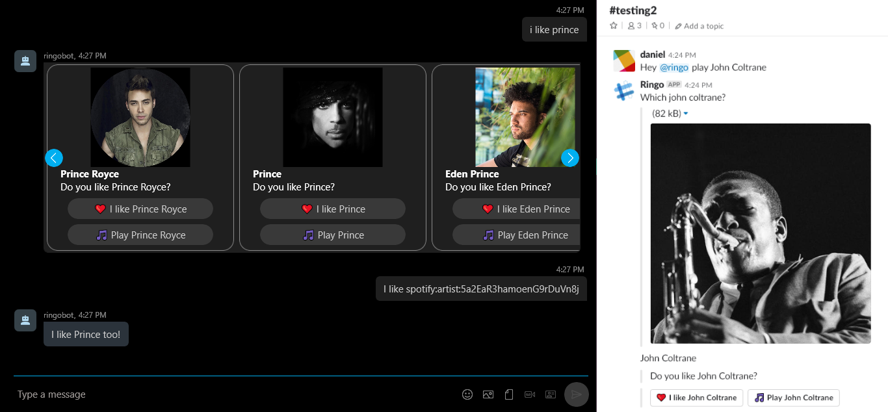
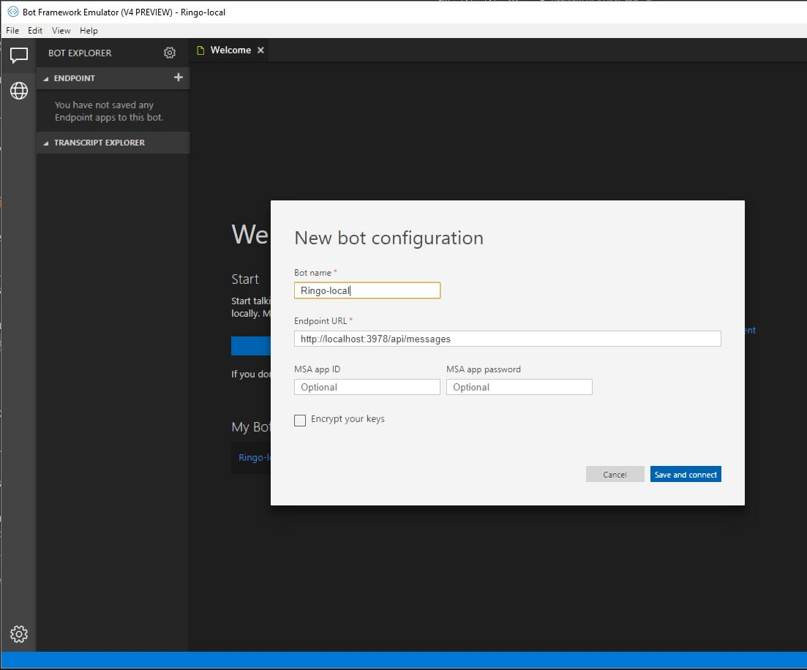
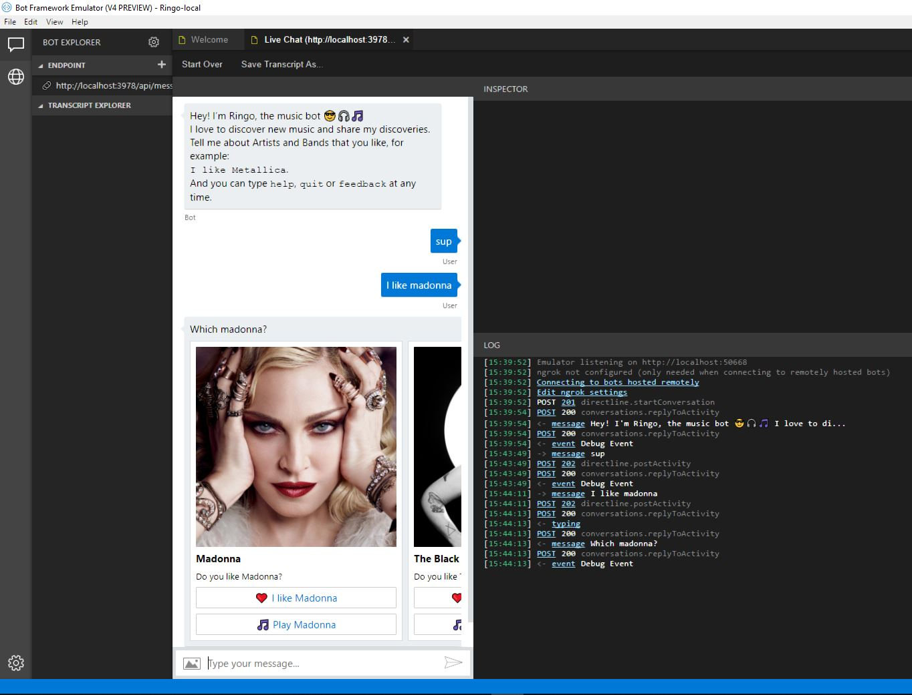

# Ringo

Ringo is a chatbot by [@DanielLarsenNZ] and [@msimpsonnz] that learns what music you
like and helps you to discover more. It is a work in progress. You can read more
about Ringo and the live demo on this website: <https://ringobot.azurewebsites.net/>



Ringo demonstrates how to build a bot using:

* Nodejs + TypeScript with Microsoft Bot Framework
* Spotify Web API
* .NET Core in Azure Functions
* Azure Cosmos DB Graph
* Azure Bot Service, App Services, Table Storage, Service Bus

[@DanielLarsenNZ]:https://github.com/DanielLarsenNZ
[@msimpsonnz]:https://github.com/msimpsonnz

## Getting started

> We recommend that you install / upgrade to the latest "LTS" (long term support)
> version of Nodejs + npm: <https://nodejs.org/en/download/>

To get the bot working on your local machine:

    git clone https://github.com/Ringobot/ringo.git
    cd ./ringo/src/Ringo.Bot
    npm install
    touch .env

Copy the following settings into a dotenv `.env` file, replacing the `<PLACEHOLDERS>`
with your own values:

```text
SpotifyApiClientId=<SPOTIFY-API-CLIENTID>
SpotifyApiClientSecret=<SPOTIFY-API-CLIENTSECRET>
AZURE_STORAGE_ACCOUNT=<STORAGE-ACCOUNT-NAME>
AZURE_STORAGE_ACCESS_KEY=<STORAGE-ACCOUNT-KEY>
GRAPH_ENDPOINT=<GRAPH-ENDPOINT>
GRAPH_ACCESS_KEY=<GRAPH-ACCESS-KEY>
GRAPH_DATABASE_ID=<GRAPH-DATABASE-ID>
GRAPH_COLLECTION_ID=<GRAPH-COLLECTION-ID>
LUIS_MODEL_URL=<LUIS-MODEL-URL>
APPINSIGHTS_INSTRUMENTATIONKEY=<APPINSIGHTS-INSTRUMENTATIONKEY>
SpotifyAuthRedirectUri=http://localhost:3978/authorize/spotify
SB_CONNECTION_STRING=Endpoint=sb://ringobotsb.servicebus.windows.net/;SharedAccessKeyName=BotSend;SharedAccessKey=<SHARED-ACCESS-KEY>
```

> Tip: `GRAPH_ENDPOINT` should be specified as a DNS name without a protocol, e.g.
> `mygraphdb.gremlin.cosmosdb.azure.com`

If you don't have Typescript installed:

    npm install -g typescript

Compile the TypeScript to JavaScript and run the tests:

    tsc
    npm test

Run the app:

    node app.js

You should see something like:

    restify listening to http://[::]:3978
    Bot is listening on /api/messages

Now create a new Bot configuration in the [Bot Framework Emulator] using the endpoint
URL `http://localhost:3978/api/messages` (change port number if necessary):

 

[Bot Framework Emulator]:https://github.com/Microsoft/BotFramework-Emulator/releases

### Prerequisites

All of these services are free or free to try:

Register for a Spotify API Key: <https://developer.spotify.com/dashboard/>

Get a free Azure Account: <https://azure.microsoft.com/en-us/free/startups/>

Azure Bot Service: <https://dev.botframework.com/>

Microsoft Bot Framework emulator: <https://github.com/Microsoft/BotFramework-Emulator/releases>

Create an Azure Storage Account: <https://azure.microsoft.com/en-us/services/storage/>

Create Cosmos DB Graph: <https://azure.microsoft.com/en-us/try/cosmosdb/>

Azure Functions: <https://azure.microsoft.com/en-us/services/functions/>

Sign up for LUIS: <https://www.luis.ai/home>

Application Insights: <https://azure.microsoft.com/en-us/services/application-insights/>

Azure Service Bus: <https://azure.microsoft.com/en-us/services/service-bus/>

## CI/CD

Ringo is built and released using Visual Studio Team Services (VSTS).
Try VSTS for free: <https://www.visualstudio.com/team-services/>


## Tests

To run the mocha (Javascript) tests:

    npm test

In CI/CD environment

    npm run-script test-vsts

## Debugging

To enable Diagnostic logging of the `console` output from nodejs in Azure App Services
(Windows), ensure this property is present in `web.config`:

```xml
<iisnode loggingEnabled="true" />
```

Then you can stream the log output to a console using `curl`, e.g:

    curl --user (deployment-username) https://ringobot.scm.azurewebsites.net/api/logstream

> **Note**: `curl` now ships with Windows! <https://blogs.technet.microsoft.com/virtualization/2017/12/19/tar-and-curl-come-to-windows/>

## More information and Links

### Deployment

Set up staging environments in Azure App Service: <https://docs.microsoft.com/en-us/azure/app-service/web-sites-staged-publishing>

Best practices for using App Service Local Cache: <https://docs.microsoft.com/en-us/azure/app-service/app-service-local-cache-overview#best-practices-for-using-app-service-local-cache>

Speeding up Azure App Service Builds: <https://wildermuth.com/2017/01/14/Speeding-up-Azure-App-Service-Builds>

### Bot Framework

Connect a bot to Slack: <https://docs.microsoft.com/en-us/azure/bot-service/bot-service-channel-connect-slack>

Channel inspector: <https://docs.botframework.com/en-us/channel-inspector/channels/Slack?f=Carousel&e=example1>

Custom recognizer: <https://docs.microsoft.com/en-us/azure/bot-service/nodejs/bot-builder-nodejs-recognize-intent-messages#register-a-custom-intent-recognizer>

### Restify

Restify cheatsheet: <https://gist.github.com/LeCoupa/0664e885fd74152d1f90>

Restify errors: <https://github.com/restify/errors>

### Spotify

Spotify Developer: <https://developer.spotify.com/web-api/console/get-search-item/#complete>

Authorisation guide: <https://beta.developer.spotify.com/documentation/general/guides/authorization-guide/#authorization-code-flow>

Spotify URIs and IDs: <https://developer.spotify.com/documentation/web-api/#spotify-uris-and-ids>

### Typescript

Downlevel Async Functions: <https://www.typescriptlang.org/docs/handbook/release-notes/typescript-2-1.html>

Unhandled Promise Rejections in Node.js: <http://thecodebarbarian.com/unhandled-promise-rejections-in-node.js.html>

The 80/20 Guide to Async/Await in Node.js: <http://thecodebarbarian.com/80-20-guide-to-async-await-in-node.js.html>

How to get node.js HTTP request promise without a single dependency: <https://www.tomas-dvorak.cz/posts/nodejs-request-without-dependencies/>

Regex tester: <https://regex101.com/>

### Testing and Mocha

Unit testing node applications with TypeScript — using mocha and chai: <https://journal.artfuldev.com/unit-testing-node-applications-with-typescript-using-mocha-and-chai-384ef05f32b2>

Unit testing a TypeScript library: <https://www.tsmean.com/articles/how-to-write-a-typescript-library/unit-testing/>

Fake Online REST API for Testing and Prototyping: <https://jsonplaceholder.typicode.com/>

Using mocha programmatically <https://github.com/mochajs/mocha/wiki/Using-mocha-programmatically>

Mocha async: <https://mochajs.org/#asynchronous-code>

### Linux, Docker, Nodejs

Install latest nodejs and npm (on Ubuntu): <https://nodejs.org/en/download/package-manager/#debian-and-ubuntu-based-linux-distributions>

    curl -sL https://deb.nodesource.com/setup_8.x | sudo -E bash - sudo apt-get install -y nodejs

Dockerizing a Node.js web app: <https://nodejs.org/en/docs/guides/nodejs-docker-webapp/>

### App Services and IIS Node

IIS Node config: <https://github.com/tjanczuk/iisnode/blob/master/src/samples/configuration/web.config>

### Application insights

<https://github.com/Microsoft/ApplicationInsights-node.js/>

How to track auth users: <https://github.com/Microsoft/ApplicationInsights-node.js/issues/356>

### More Links

Emojipedia: <https://emojipedia.org/people/>

## Logging

<https://stackify.com/net-core-loggerfactory-use-correctly/>

<https://www.blinkingcaret.com/2018/02/14/net-core-console-logging/>

## Bot builder storage (C#)

<https://docs.microsoft.com/en-us/azure/bot-service/bot-builder-howto-v4-storage?view=azure-bot-service-4.0&tabs=csharp>

## Cosmos DB

At time of writing there was no Azure Table Storage nuget for .NET Standard. <https://docs.microsoft.com/en-us/azure/cosmos-db/table-storage-how-to-use-dotnet>

Cosmos DB .NET Samples: <https://github.com/Azure/azure-cosmos-dotnet-v2/blob/f374cc601f4cf08d11c88f0c3fa7dcefaf7ecfe8/samples/code-samples/DocumentManagement/Program.cs#L211>

Optimistic concurrency: <https://chapsas.com/understanding-optimistic-concurrency-in-cosmos-db/>

Read Azure DocumentDB document that might not exist: <https://stackoverflow.com/a/35488563/610731>

### Cosmos DB .NET Core SDK

<https://docs.microsoft.com/en-us/azure/cosmos-db/sql-api-dotnetcore-get-started#CreateDoc>

### TTL

<https://docs.microsoft.com/en-us/azure/cosmos-db/time-to-live>

<https://docs.microsoft.com/en-us/azure/cosmos-db/how-to-time-to-live#set-time-to-live-on-an-item>

